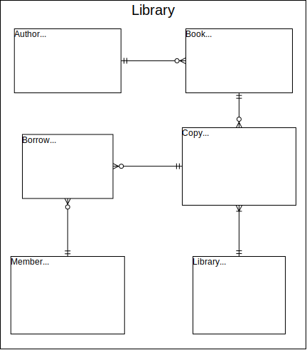

# Library database
Main purpose of this project was to practice designing database schema using entity relational diagram & later implementing that specification in PostgreSQL & deployment with Docker.
 

## Development Steps:
* Diagram entities
* Diagram entity relationships
* Database & user/role setup
* Create tables
* Generate table data
* Setup Docker image

## Installation
* Make sure that Docker is installed
* Run: `docker image build -t library:1.0 .` to build image
* Run: `docker container run -d  -p 5432:5432 --name library-container library:1.0` to start container
* Use command line tools like psql or pgcli to enter database
* Example: `psql -h localhost -p 5432 -U postgres -d library -W` & on prompt enter password specified in Dockerfile environment variable